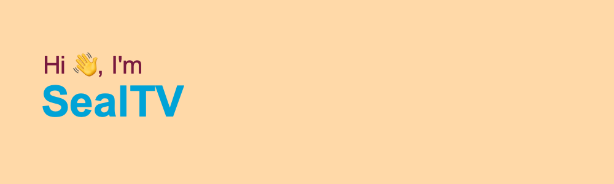

# Hi! I'm SealTV 🦭

## 👨‍💻 About Me

I'm a passionate developer with expertise in Go, JavaScript, and Rust. I love working on challenging projects and exploring new technologies. My interests span from backend development to blockchain and everything in between!

## 🛠️ Technologies & Tools

## 🌱 Currently Learning

- Advanced Rust programming techniques
- Blockchain development with Solidity
- Microservices architecture with Go

## 🚀 Featured Projects

- [Cielo Go](https://github.com/SealTV/cielogo) - CieloGo is a Go client library for interacting with the [Cielo Finance API](https://api-info.cielo.finance/)

## 📊 GitHub Stats

  

  

  

## 💡 Fun Fact

Once, I had to survive for two days in the forests of Karelia with nothing but a map, a compass, and a homemade knife, without food or water.

## 📫 Get in Touch

Feel free to reach out to me on [Telegram](https://t.me/SealTV) or [Twitter](https://twitter.com/SealTV_) for collaborations or just a friendly chat!

---

⭐️ From [SealTV](https://github.com/SealTV)
